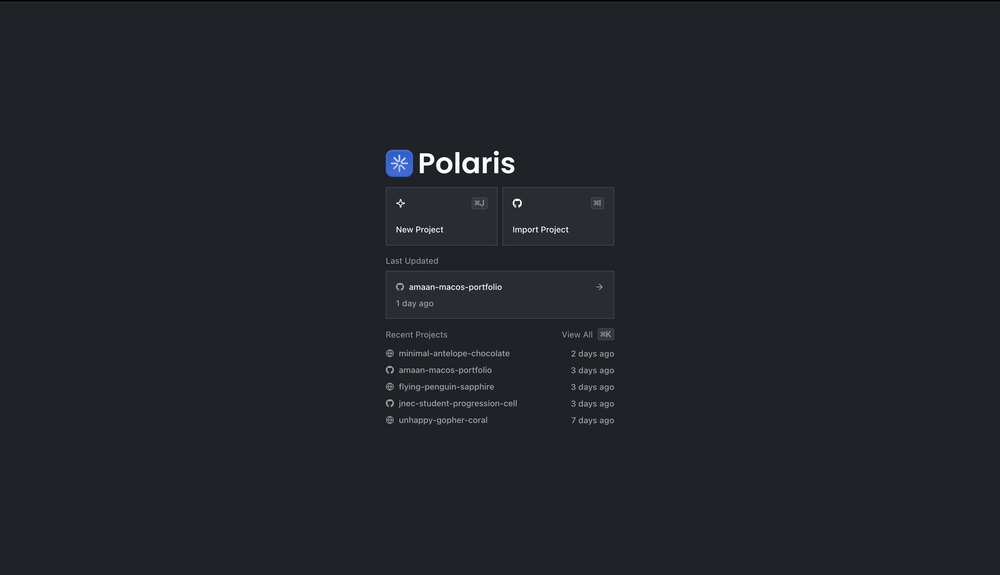
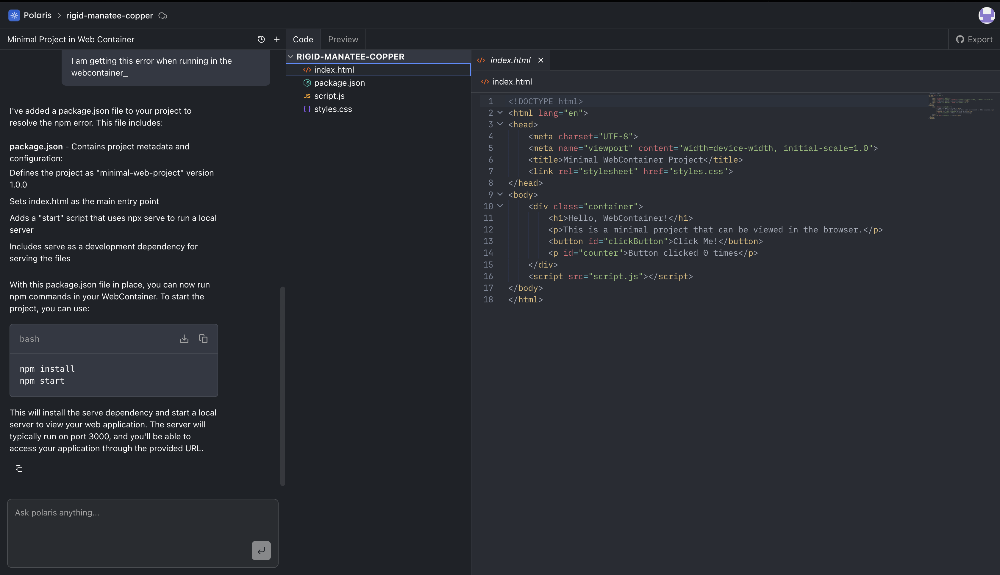
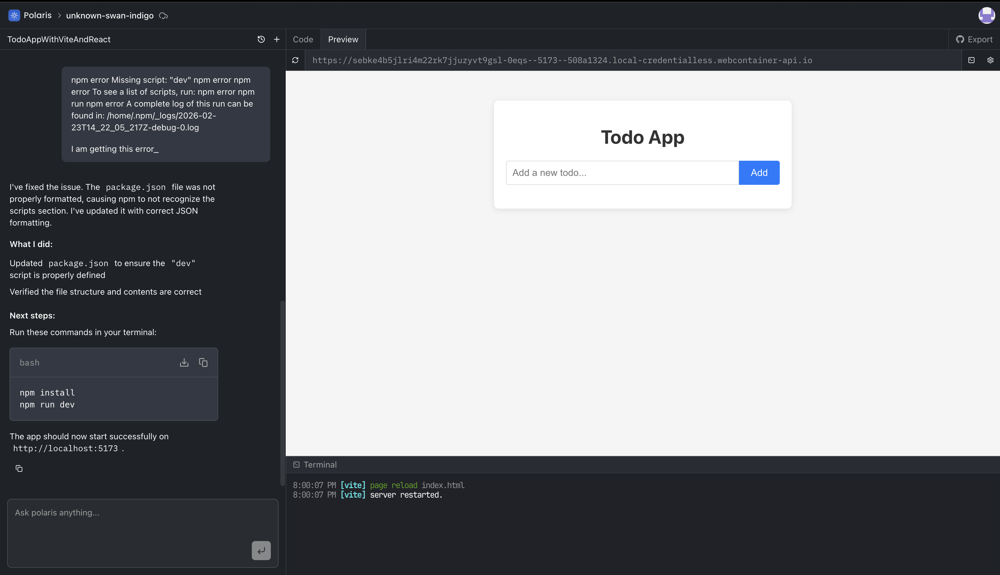

# Polaris

<p align="center">
  
  
  
  
  
</p>

<p align="center">
  <b>AI-powered full-stack development environment for building and previewing web applications directly in your browser.</b>
</p>

<p align="center">
  <a href="https://polaris-jade-three.vercel.app" target="_blank">🚀 Live Demo</a> •
  <a href="#features">Features</a> •
  <a href="#screenshots">Screenshots</a> •
  <a href="#tech-stack">Tech Stack</a> •
  <a href="#getting-started">Getting Started</a> •
  <a href="#usage">Usage</a>
</p>

<p align="center">
  
</p>

---

## ✨ Features

- **AI Coding Assistant** - Generate complete applications with intelligent code generation powered by Groq, OpenAI, Anthropic, and Google AI
- **Context-Aware Editing** - AI reads existing code and makes smart modifications
- **Advanced Code Editor** - Professional CodeMirror 6 integration with syntax highlighting for 20+ languages
- **Live Preview** - Run Node.js applications directly in browser with WebContainer API
- **Real-Time Updates** - See changes instantly as you edit with hot module reloading
- **Terminal Access** - Full terminal support with xterm.js for running commands
- **GitHub Integration** - Import projects from GitHub and export back seamlessly
- **File Management** - Complete file tree with create, rename, delete, and organize operations
- **Multi-Tab Editing** - Work on multiple files simultaneously with tab management
- **Cloud Storage** - Projects stored securely with Convex real-time backend
- **Auto-Save** - Never lose work with automatic saving
- **Split View** - Resizable panels for code, preview, and terminal

---

## 📸 Screenshots

### Home Dashboard



<p align="center"><i>Manage all your projects from a centralized dashboard</i></p>

### Project Workspace



<p align="center"><i>Full-featured development environment with AI chat, code editor, and live preview</i></p>

### Live Preview & Terminal



<p align="center"><i>Run applications in-browser with WebContainer and access terminal for commands</i></p>

---

## 🛠 Tech Stack

### Frontend
- **[Next.js 16](https://nextjs.org/)** - React framework with App Router
- **[React 19](https://react.dev/)** - Latest React with concurrent features
- **[TypeScript](https://www.typescriptlang.org/)** - Type-safe development
- **[Tailwind CSS v4](https://tailwindcss.com/)** - Utility-first styling
- **[shadcn/ui](https://ui.shadcn.com/)** - Beautiful, accessible components
- **[CodeMirror 6](https://codemirror.net/)** - Extensible code editor
- **[Framer Motion](https://www.framer.com/motion/)** - Smooth animations
- **[Allotment](https://github.com/johnwalley/allotment)** - Resizable split views

### Backend & Infrastructure
- **[Convex](https://convex.dev/)** - Real-time backend with type-safe queries
- **[Clerk](https://clerk.com/)** - Authentication and user management
- **[Inngest](https://inngest.com/)** - Background job processing for AI workflows
- **[Sentry](https://sentry.io/)** - Error tracking and monitoring

### AI & Code Execution
- **[Vercel AI SDK](https://sdk.vercel.ai/)** - Unified AI interface
- **[Inngest Agent Kit](https://www.inngest.com/docs/agent-kit)** - AI agent orchestration with tools
- **[WebContainer API](https://webcontainers.io/)** - Browser-based Node.js runtime
- **[xterm.js](https://xtermjs.org/)** - Terminal emulator

### AI Models
- **[Groq](https://groq.com/)** - Fast inference with open-source models
- **[OpenAI](https://openai.com/)** - GPT models
- **[Anthropic](https://anthropic.com/)** - Claude AI
- **[Google Gemini](https://ai.google.dev/)** - Gemini AI

### Integrations
- **[Octokit](https://github.com/octokit)** - GitHub API integration
- **[Firecrawl](https://firecrawl.dev/)** - Web scraping for AI context

---

## 🚀 Getting Started

### Prerequisites

- Node.js 18+
- npm, yarn, pnpm, or bun package manager

### Installation

1. **Clone the repository**
   ```bash
   git clone https://github.com/amaan-ur-raheman/polaris.git
   cd polaris
   ```

2. **Install dependencies**
   ```bash
   npm install
   ```

3. **Set up environment variables**
   ```bash
   cp .env.example .env.local
   ```

   Required environment variables:
   ```env
   # Convex
   NEXT_PUBLIC_CONVEX_URL="your-convex-url"
   CONVEX_DEPLOYMENT="your-deployment"

   # Clerk Authentication
   NEXT_PUBLIC_CLERK_PUBLISHABLE_KEY="your-clerk-key"
   CLERK_SECRET_KEY="your-clerk-secret"

   # AI Models (at least one required)
   GROQ_API_KEY="your-groq-key"
   OPENAI_API_KEY="your-openai-key"

   # GitHub Integration
   GITHUB_TOKEN="your-github-token"

   # Inngest (for AI workflows)
   INNGEST_EVENT_KEY="your-inngest-key"
   INNGEST_SIGNING_KEY="your-signing-key"

   # Firecrawl (optional)
   FIRECRAWL_API_KEY="your-firecrawl-key"
   ```

4. **Start the development server**
   ```bash
   npm run dev
   ```

   The app will be available at `http://localhost:3000`

### Development with All Services

To run with Convex and Inngest for full functionality:

```bash
# Terminal 1: Start Next.js
npm run dev

# Terminal 2: Start Convex
npm run convex:dev

# Terminal 3: Start Inngest
npm run inngest:dev

# Or use mprocs to run all services
npm run dev:all
```

---

## 📖 Usage

### Creating a New Project

1. Click **"New Project"** from the dashboard
2. Choose to start from scratch or import from GitHub
3. Start chatting with the AI to build your application

### Working with AI

- Describe what you want to build in natural language
- AI will create all necessary files and folders
- Review changes in the editor and preview
- Continue the conversation to refine and iterate

**Example prompts:**
- "Create a React todo app with TypeScript"
- "Add a dark mode toggle to the navbar"
- "Create an API endpoint for user authentication"

### Running Your Project

- The preview pane automatically detects your project type
- Configure install and dev commands in project settings
- Use the integrated terminal for custom commands
- View console logs and errors in real-time

### GitHub Integration

**Import from GitHub:**
1. Click "Import from GitHub"
2. Enter repository URL
3. Project files are cloned automatically

**Export to GitHub:**
1. Click the GitHub export button
2. Choose to create a new repository or push to existing
3. Your project is instantly available on GitHub

---

## 🏗️ Project Structure

```
polaris/
├── src/
│   ├── app/                    # Next.js App Router
│   │   ├── api/                # API routes
│   │   └── projects/           # Project pages
│   ├── components/
│   │   ├── ui/                 # shadcn/ui components
│   │   └── ai-elements/        # AI-specific components
│   ├── features/               # Feature-based modules
│   │   ├── auth/               # Authentication
│   │   ├── conversations/      # AI chat functionality
│   │   │   └── inngest/        # AI agent tools & workflows
│   │   ├── editor/             # Code editor
│   │   ├── preview/            # WebContainer preview
│   │   └── projects/           # Project management
│   ├── lib/                    # Utilities and configs
│   ├── hooks/                  # Custom React hooks
│   └── inngest/                # Inngest configuration
├── convex/                     # Convex backend
│   ├── schema.ts               # Database schema
│   ├── projects.ts             # Project queries/mutations
│   ├── files.ts                # File operations
│   └── conversations.ts        # Chat history
└── public/                     # Static assets
```

---

## 🤖 AI Agent Tools

Polaris AI has access to the following tools for code generation:

| Tool | Description |
|------|-------------|
| **listFiles** | List all files and folders in the project |
| **readFiles** | Read content of specific files |
| **createFiles** | Create multiple files in batch |
| **updateFile** | Modify existing file content |
| **deleteFiles** | Remove files or folders |
| **createFolder** | Create new directories |
| **renameFile** | Rename files or folders |
| **scrapeUrls** | Fetch content from URLs for context |

---

## 🌐 Browser Compatibility

Polaris uses WebContainer API which requires:
- **Chrome/Edge** 102+ (recommended)
- **Safari** 16.4+ (limited support)
- **Firefox** - Not supported (WebContainer limitation)

---

## 🤝 Contributing

Contributions are welcome! Please feel free to submit a Pull Request.

1. Fork the repository
2. Create your feature branch (`git checkout -b feature/amazing-feature`)
3. Commit your changes (`git commit -m 'Add some amazing feature'`)
4. Push to the branch (`git push origin feature/amazing-feature`)
5. Open a Pull Request

---

## 📄 License

This project is licensed under the MIT License - see the [LICENSE](LICENSE) file for details.

---

## 🙏 Acknowledgments

- [Next.js](https://nextjs.org/) - The React Framework
- [Convex](https://convex.dev/) - Real-time backend platform
- [WebContainer](https://webcontainers.io/) - Browser-based Node.js runtime
- [shadcn/ui](https://ui.shadcn.com/) - Beautiful component library
- [Inngest](https://inngest.com/) - Reliable background jobs
- [Clerk](https://clerk.com/) - Authentication made easy

---

<p align="center">
  Built with ❤️ using Next.js, Convex, and WebContainer
</p>

<p align="center">
  <a href="https://github.com/amaan-ur-raheman/polaris">⭐ Star on GitHub</a>
</p>
